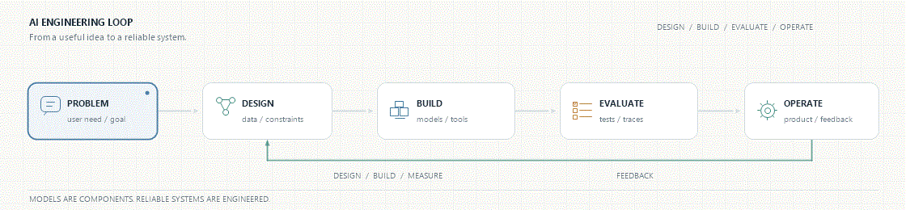

# Muhammad Daffa Arigoh

**AI Engineer · Retrieval systems · Agentic workflows**

I build AI applications where retrieval, reasoning, and software engineering meet.

*Models are components. Reliable systems are engineered.*

---

## What I work on

I’m interested in the parts of AI engineering that make an LLM application dependable beyond a demo:

- **Retrieval:** hybrid search, reranking, source attribution, and context quality.
- **Agentic systems:** tool-using workflows with explicit boundaries and human approval.
- **Evaluation:** test cases and retrieval metrics that make changes measurable.
- **AI backends:** APIs, streaming, data stores, and the operational glue around models.

## Selected work

### [Production RAG Engine](https://github.com/daffaarigoh/production-rag-engine)

A document question-answering system that combines dense retrieval with BM25, fuses rankings, reranks candidates, and returns answers grounded in cited source passages. Includes an evaluation path with RAGAS.

**ChromaDB · FastEmbed · BM25 · RRF · FlashRank · FastAPI · RAGAS**

### [AutoRestock-Agent](https://github.com/daffaarigoh/AutoRestock-Agent)

An enterprise workflow automation platform that connects LLM-driven agents to structured operations, with role-aware access and human approval steps.

**FastAPI · LangGraph · DuckDB · Typst · Server-Sent Events**

## Tools I use

| Area | Tools |
|---|---|
| LLM applications | LangChain, LangGraph, tool calling, prompt guardrails |
| Retrieval | ChromaDB, FastEmbed, BM25, RRF, FlashRank, Qdrant |
| Evaluation | RAGAS, pytest |
| Backend | Python, FastAPI, Pydantic, Uvicorn |
| Storage and delivery | DuckDB, Docker, GitHub Actions |
| Model access | Groq, OpenAI, Gemini, Ollama |

## How I think about AI systems

- A useful answer should show where its evidence came from.
- An agent should have a clear tool boundary and a safe handoff when judgment belongs to a person.
- Evaluation should describe the behavior we want to preserve—not just produce a score.

## Connect

- **Email:** [daffaarigo02@gmail.com](mailto:daffaarigo02@gmail.com)
- **GitHub:** [@daffaarigoh](https://github.com/daffaarigoh)

---

Built around a simple idea: make the reasoning path easier to inspect.

